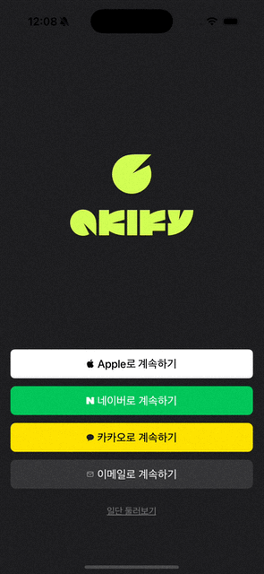
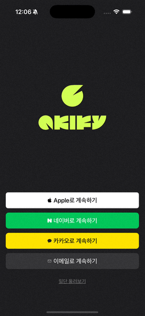
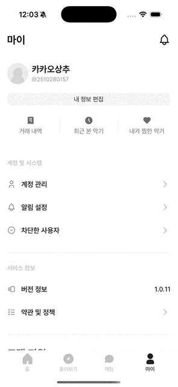

# Akify (아키파이)

중고 악기 거래 플랫폼  
React Native 기반 iOS / Android 크로스 플랫폼 앱

> ⚠️ 본 레포지토리는 서비스 v1 초기 개발 코드 아카이브입니다.
> 현재 스토어에 배포된 최신 버전과 일부 차이가 있을 수 있습니다.
> API key 등 중요 정보는 마스킹처리 및 삭제하였습니다.

---

## 📌 제작 인원 & 기간

- 인원: Frontend 4명, Backend 2명, Designer 2명
- 기간: 2025.07. ~ 2025.10. (v1 운영)

---

## 📱 프로젝트 개요

**Akify(아키파이)** 는 악기 사용자들을 위한 중고 거래 앱으로, 사용자가 악기를 손쉽게 검색하고, 상세 정보와 조건을 입력해 매물을 등록하며, 다른 사용자와 채팅을 통해 거래할 수 있도록 합니다.
실시간 알림, 신뢰 기반 매물 시스템, 선택적 인증 등의 기능을 제공합니다.

---

## ✨ 주요 기능

- 악기 검색 및 필터링
- 매물 등록 및 관리 (사진, 모델, 상태, 가격 입력)
- 1:1 채팅 기능 (TalkPlus 연동)
- 푸시 알림
- 이메일 / SNS 로그인 및 회원가입
- iOS / Android 크로스 플랫폼 대응

---

## 🛠 기술 스택

- **Frontend:** React Native, TypeScript, Zustand
- **Backend:** Spring Boot, PostgreSQL
- **Infra & SDK:** Firebase, TalkPlus, Danal 본인인증

---

## 🖼️ 서비스 화면

| 기능          | 화면                                               |
| ------------- | -------------------------------------------------- |
| 소셜 회원가입 |    |
| 소셜 로그인   |       |
| 홈 화면       |                  |
| 매물 등록     | [🎬 매물 등록 영상 보기](./images/akifyUpload.mp4) |
| 둘러보기      |          |
| 매물 검색     |              |
| 채팅          | [🎬 채팅 영상 보기](./images/akifyChatting.mp4)    |
| 마이페이지    |             |

---

## 🧑‍💻 담당 역할

**Frontend 개발 리드**

- Danal 본인인증 기능 연동
- TalkPlus 1:1 채팅 기능 구현
- 홈 화면 및 마이페이지 UI 개발
- 채널톡 고객 지원 시스템 통합

---

## 🔗 관련 링크

- 홈페이지: https://akify.io
- Google Play: https://play.google.com/store/apps/details?id=com.jammering.akify
- App Store: https://apps.apple.com/kr/app/id6751454780

---

## 📖 프로젝트 회고

### ✔️ 경험한 점

실제 서비스를 배포하고 운영하면서 개발 단계에서는 미처 생각하지 못했던 부분들을 경험할 수 있었습니다. iOS와 Android 양쪽 플랫폼 모두에 대응하다 보니 라이브러리 선택과 네이티브 기능 연동에 제약이 있었고, 이를 해결하는 과정에서 크로스 플랫폼 개발의 특성을 이해하게 되었습니다.

다날 본인인증, TalkPlus 채팅 등 외부 솔루션 업체와의 연동 작업을 통해 실제 상용 서비스에서 사용되는 써드파티 SDK 통합 방법을 배울 수 있었습니다. 또한 앱스토어 심사 과정을 직접 경험하며 배포 전 체크리스트와 가이드라인 준수의 중요성을 체감했습니다.

---

### ✔️ 아쉬웠던 점

디자이너와 협업한 첫 프로젝트였기에 디자인 시스템을 체계적으로 적용하지 못한 점이 아쉬웠습니다. 프로젝트 초반에 컴포넌트 명세와 재사용 기준을 명확히 정의했다면 중복 컴포넌트 발생을 줄일 수 있었을 것입니다. 실제로 개발 후반부에 유사한 컴포넌트들을 통합하는 과정을 거쳤는데, 초기 설계 단계에서 더 꼼꼼히 체크했다면 시간을 절약할 수 있었을 것 같습니다.

또한 예상치 못한 사용자 동작과 엣지 케이스에 대한 테스트가 부족했습니다. 배포 후 사용자 피드백을 통해 발견된 오류들을 수정하며, 출시 전 다양한 시나리오를 미리 검증하는 것의 중요성을 깨달았습니다.

---

### ✔️ 새롭게 배운 기술 및 역량

- React Native 기반 iOS / Android 크로스 플랫폼 개발
- 외부 SDK (Danal, TalkPlus, Firebase) 통합
- Google Play / App Store 배포 및 심사 대응
- 디자인 시스템 기반 컴포넌트 설계
- 실제 서비스 운영 및 버전 관리 경험

---

### ✔️ 깨달은 점

실제 서비스를 운영하면서 사용자 피드백에 대한 빠른 대응이 얼마나 중요한지 체감했습니다. 버그 리포트나 기능 개선 요청에 신속하게 반응하고 업데이트를 배포하는 과정을 통해 사용자 중심의 서비스 운영 마인드를 갖게 되었습니다.

안정적인 서비스를 유지하기 위한 에러 핸들링, 예외 상황 처리, 성능 모니터링의 중요성을 이해하게 되었습니다. 실제 사용자가 있는 서비스를 운영한다는 것은 지속적인 개선과 책임감이 필요한 일임을 배웠습니다.
