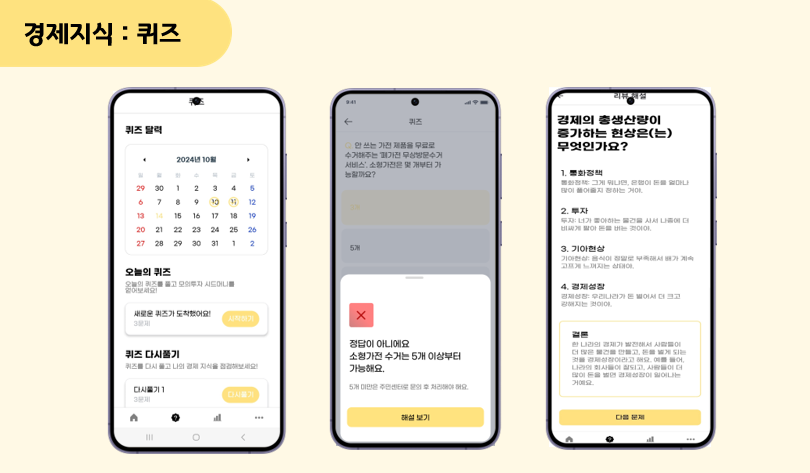
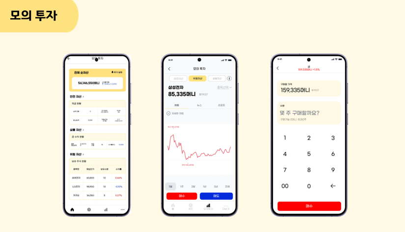
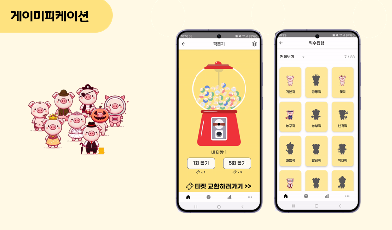
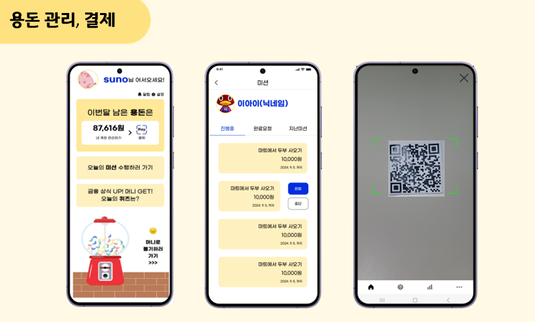
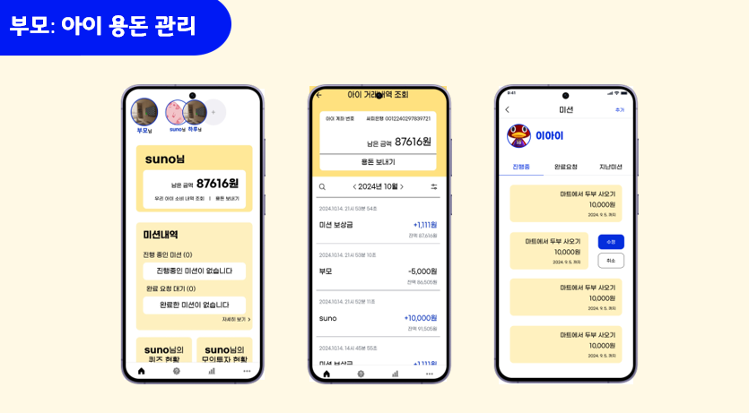

# 돈Zoom (DonZoom)

아이들을 위한 금융 교육 통합 플랫폼  
(SSAFY 특화프로젝트 우수상)

> SSAFY(삼성 SW 아카데미) 과정 프로젝트이며, 당시 배포·도메인은 현재 운영되지 않습니다.

## 📌 제작 인원 & 제작 기간

- frontend 3명, backend 3명 (총 6명)
- 2024.08.19 ~ 2024.10.11 (총 7주)

## 📱 프로젝트 개요

DonZoom은 어린이의 자산 관리를 돕고 금융 지식을 자연스럽게 학습할 수 있도록 구성된 어린이 맞춤형 금융 교육 통합 플랫폼입니다. 실제 주식 데이터를 활용한 모의 투자, 1일 3문항의 경제 퀴즈, 부모와의 연동 기능, 용돈 입출금 관리, 캐릭터 뽑기 시스템 등 다양한 학습 요소를 게임화하여 학습 몰입도를 높였습니다.

## ✨ 주요 기능

- 용돈 관리 및 입출금 기능
- 실제 주식 정보를 반영한 모의 주식 투자
- 1일 3문항 경제 상식 퀴즈 (GPT 기반 생성)
- 부모와 미션 활동 연동을 통한 추가 용돈 지급
- 가상 화폐로 캐릭터 뽑기 및 수집 기능

## 🖼️ 서비스 화면

| 기능           | 화면                                               |
| -------------- | -------------------------------------------------- |
| 경제 상식 퀴즈 |           |
| 모의 주식 투자 |          |
| 캐릭터 뽑기   |              |
| 용돈 결제     |                  |
| 부모 연동     |             |

## 🧑‍💻 담당 역할

UI/UX 기획, Frontend, 팀장, 발표

- Figma 기반 UI/UX 기획
- 부모-아이 분리 UI 설계 및 상태 관리 구현
- QR 생성 및 결제 기능 구현
- GPT 기반 경제 상식 퀴즈 1일 3문제 자동 생성 기능 구현
- 캐릭터 뽑기 시스템 개발

## 🛠 기술 스택

React-Native, TypeScript, Zustand, React-Query, StyleSheet, Figma

## 📖 프로젝트 회고

실제 데이터를 기반으로 사용자에게 정보를 제공하는 과정에서 API 호출을 최소화하고 성능을 고려한 클라이언트 구성의 중요성을 체감했습니다. React-Query를 활용하여 주식 데이터 캐싱과 API 호출 빈도를 최적화했으며, 네트워크 상황에 따른 UX 흐름까지 고려할 수 있었습니다.

캐릭터 뽑기 기능 구현 과정에서는 사용자가 연속으로 뽑기를 진행할 때마다 렌더링이 누적되어 성능 저하가 발생하는 문제를 겪었습니다. 이를 해결하기 위해 부모 컴포넌트와 자식 컴포넌트를 명확히 분리하여 불필요한 렌더링을 줄임으로써 사용자 경험을 유지하면서 성능 개선 효과를 얻었습니다.

### ✔️ 아쉬웠던 점

팀장으로서 프로젝트 전반의 일정 관리도 함께 맡았는데, 기능 구현에 집중하느라 세부 일정 관리에 소홀했던 점이 아쉬웠습니다. 기능 우선순위 설정과 주 단위 마일스톤 관리를 철저히 하여 일정 지연을 방지하는 것에 대해 의식하고 진행하는 계기가 되었습니다.

### ✔️ 개발 역량 및 새롭게 배운 기술

- React Query를 활용한 데이터 캐싱 및 상태 관리 전략
- React Native 기반 모바일 화면 구현 및 라이브러리 활용
- 성능 최적화를 위한 컴포넌트 분리
- 사용자 중심 게이미피케이션 UX 설계 및 흐름 제어

---

### ✔️ 깨달은 점

아이들이 주 사용자인 앱에서 단순히 기능 구현만이 아닌, 그들에게 맞는 섬세한 설계가 필요함을 느꼈습니다. 단어 선택 하나하나가 아이들의 이해도를 좌우할 수 있었고, 배경색상과 폰트 크기, 터치 영역과 같은 시각적 요소들 또한 아이들 맞춤형으로 설계했습니다. 또한 아이들이 반복적으로 사용하는 기능에서 발생할 수 있는 성능 저하 문제를 사전에 방지하기 위한 구조적인 설계 역시 중요하다는 점을 깨달았습니다. 사용자의 상황과 특성에 맞춘 흐름을 생각하며 사용자 친화적 기능을 구현하는 것을 생각하게 된 계기가 되었습니다.
